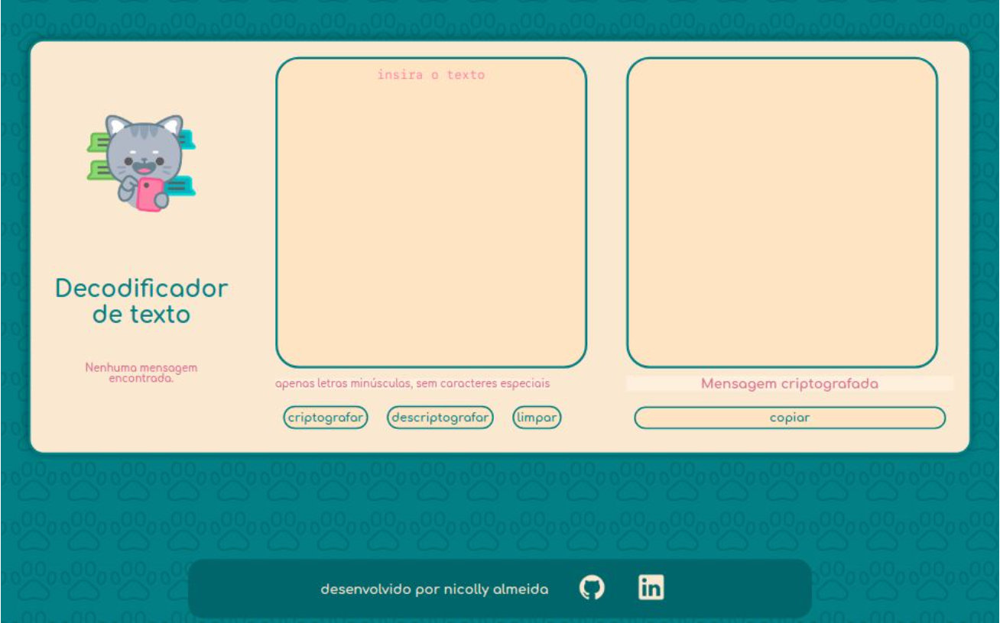

# Decodificador 🐈
Decodificador de texto - ALURA/ORACLE

Este decodificador faz parte do projeto ONE Next Education. E como requisito para a próxima fase, deveriámos utilizar nossos conhecimentos em HTML, CSS e JavaScript para entregar um decodificador de texto simples.

# Configurações 💌

<h3> Criptografia: </h3>
- A letra "e" é convertida para "enter"  
- A letra "i" é convertida para "imes"  
- A letra "a" é convertida para "ai"  
- A letra "o" é convertida para "ober"  
- A letra "u" é convertida para "ufat"

<h3>Descriptografia: </h3>

- "enter" é convertida para a letra "e"  
- "imes" é convertida para a letra "i"  
- "ai" é convertida para a letra "a"  
- "ober" é convertida para a letra "o"  
- "ufat" é convertida para a letra "u" 

<h3>Por exemplo:</h3>
"gato" => "gaitober"  
gaitober" => "gato"

 # Requisitos 🐾 
 
- Funciona apenas com letras minúsculas sem acentos e caracteres especiais.
- Caso se utilize letras maiúsculas e acentuadas, uma mensagem de erro será impressa e a codificação não sera feita.

# Funcionalidade 😸

 - Digite sua mensagem, depois clique no botão desejado e divirta-se. 

 <h2>Clique para acessar no seu navegador:</h2>
 

